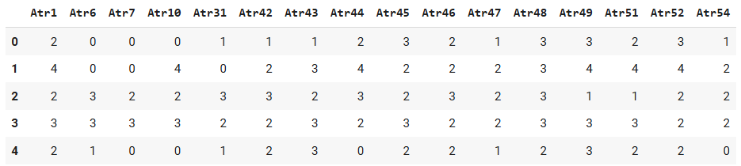
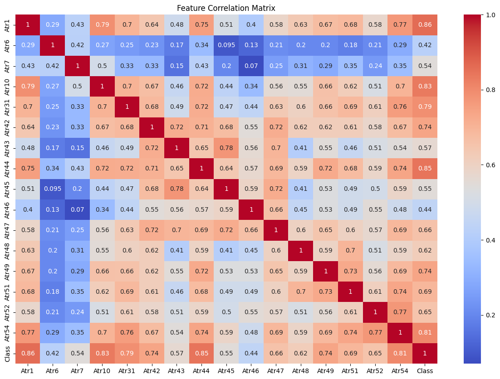
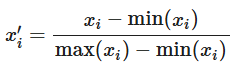
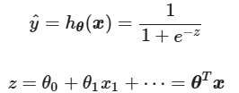
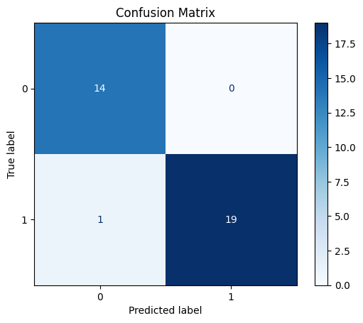
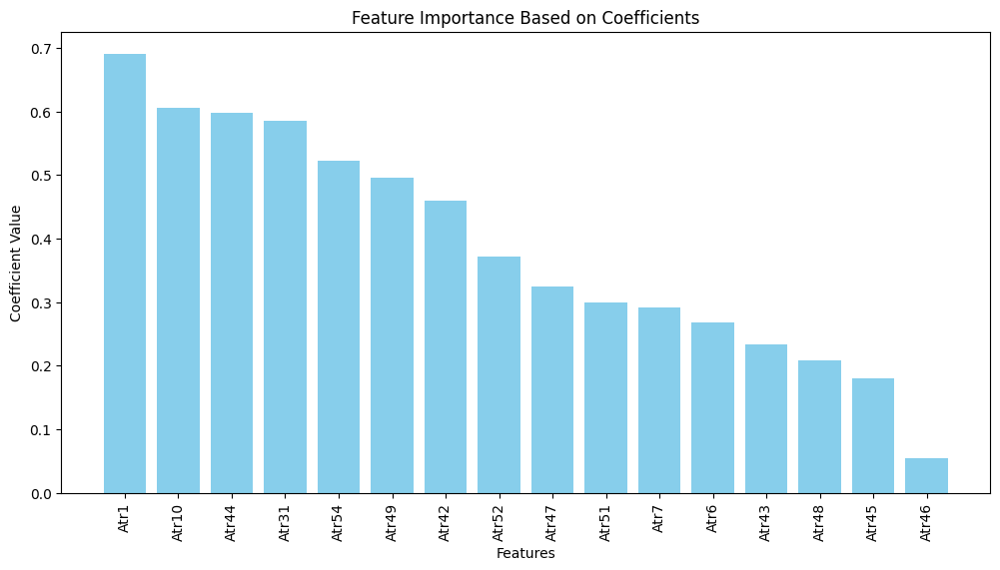
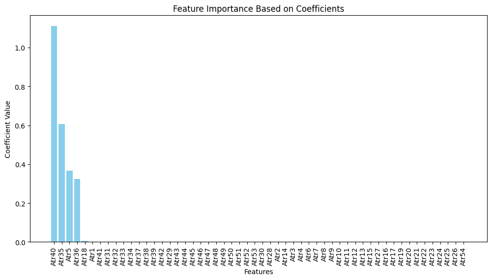

#

## Introduction 

Through 40+ years of psychotherapy research, Dr. John Gottman developed multiple models to predict marital stability and divorce in couples [2]. In Gottman’s book, The Seven Principles for Making Marriage Work, he outlines four negative behaviors that are most likely to predict divorce. These behaviors are known as the “four horsemen” which are contempt for a partner, criticism of a partner’s personality, stonewalling, and defensiveness [2]. Through his research, he developed a Divorce Predictors Scale (DPS) survey that therapy practitioners use once trained at the Gottman Institute to predict if a couple will stay married or get a divorce. The survey contains 54 questions, with a 1 - 5 likert scale, intending to measure various aspects of the marital relationship connected to the four horsemen and other related research [3]. This paper intends to evaluate the survey, using machine learning classification models, to see if the survey questions do actually predict if a couple is likely to get divorced.   

In running the models, we find that the Gottman survey contains many questions that are strong predictors of divorce. We created two predictive models that produced a 97.5% accuracy rate in prediction based on survey responses, using different subsets of the 54 questions provided. 
 

## Data

The DPS data was donated in July 2019 to UC Irvine’s ML Repository [5]. Respondents answered 54 relationship questions on a scale of 1 to 5. The dataset contained 170 instances, consisting of 84 (49%) divorced and 86 (51%) married responses. Questions varied in scale types, utilizing frequency questions (e.g. “Never - 1” and “Always - 5”) and agreement questions (“Strongly Disagree - 1” and “Strongly Agree - 5”). The target variable was provided, with 2 classes indicating whether or not the respondent later got divorced (e.g., "yes" and "no", or 1 and 0) [5]. Additionally, the likert responses came already normalized from 0 - 4 instead of 1 to 5 and pre-processed with respect to removing NA values. A caveat for this paper is that some of the questions themselves seemed to have some significant grammatical errors. If this study were to be replicated, the data needs to be collected from the Gottman Institute or original researchers directly. 

[Link to ML Code](https://colab.research.google.com/drive/1uAk6AZ1CN1QjFoz7_lxrqYTia0-MdHL6?usp=sharing)

#### Model 1: Data Pre-processing

In further pre-processing of the data, a correlation based feature selection analysis was done in order to remove features highly correlated with one another. This removed any features with features to target correlations below 0.2 or feature to feature correlations below 0.8. As a result, only 16 survey questions (features) remained in the ML sample we used to perform a logistic regression analysis with. 
This was done in order to address multicollinearity between features given that many of the questions might be similar or conceptually related. Given that the questions were created through qualitative means,  For example, several questions such as “When discussing with my wife, I usually use expressions such as you alway or you never” and “I can use negative statements about my wife's personality during our discussions” might assess level of criticism present in the relationship in slightly different ways. 

Specifically, the DPS questions are as provided in Table 1 for Model 1. The full set of questions is provided in the appendix. 

_Table 1: Survey Questions Subsetted from 54 Original Questions_
<table>
  <thead>
    <tr>
      <th>Survey Questions</th>
    </tr>
  </thead>
  <tbody>
    <tr><td>Atr 1. When one of our discussions goes in a bad direction, the issue does not extend.</td></tr>
    <tr><td>Atr 6. We don’t have time at home as partners.</td></tr>
    <tr><td>Atr 7. We are like two strangers who share the same environment at home rather than family.</td></tr>
    <tr><td>Atr 10. My wife and most of our goals are common.</td></tr>
    <tr><td>Atr 31. I feel aggressive when I argue with my wife.</td></tr>
    <tr><td>Atr 42. When I argue with my wife, it’s only snaps and I don’t say a word.</td></tr>
    <tr><td>Atr 43. I’m mostly thirsty to calm the environment a little bit.</td></tr>
    <tr><td>Atr 44. Sometimes I think it’s good for me to leave home for a while.</td></tr>
    <tr><td>Atr 45. I’d rather stay silent than argue with my wife.</td></tr>
    <tr><td>Atr 46. Even if I’m right in the argument, I’m thirsty not to upset the other side.</td></tr>
    <tr><td>Atr 47. When I argue with my wife, I remain silent because I am afraid of not being able to control my anger.</td></tr>
    <tr><td>Atr 48. I feel right in our discussions.</td></tr>
    <tr><td>Atr 49. I have nothing to do with what I’ve been accused of.</td></tr>
    <tr><td>Atr 51. I’m not the one who’s wrong about problems at home.</td></tr>
    <tr><td>Atr 52. I wouldn’t hesitate to tell her about my wife’s inadequacy.</td></tr>
    <tr><td>Atr 54. I’m not afraid to tell her about my wife’s incompetence.</td></tr>
  </tbody>
</table>

__Figure 1: Sample of the Dataset; n = 170, Features = 16__

After removing the highly correlated features in the original data set, our new model only retained features to feature correlations under the 0.80 threshold. Features above the threshold are considered redundant. This feature correlation matrix reflects the correlation values of the sample used in the ML classification. 
 

__Figure 2: Feature Correlation Matrix of Sample__ 

 

#### Model 2: Data Pre-processing

Model 2 uses all 54 Features in the dataset, but instead uses Lasso Regularization to deal with multicollinearity between features. 

  
## Modeling

Prior to starting the analysis, a Spearman’s Rank Correlation was performed to check for a linear relationship between features and the target outcome. It showed a linear relationship, with all 54 features having a statistically significant, high to medium correlation coefficient with respect to the target, ranging from 0.45 to 0.90. Given that a binary classification of the outcome is provided and we have a small sample size of m = 170, utilizing a supervised learning logistic regression model would provide the most direct insight into the relationship between each feature and probability of divorce.

The sample data was normalized to improve the convergence of the algorithm. Min-max normalization was used to convert input features  xi  to be within the range 0 to 1. The converted feature  x′i  is given by:  
  
In code, we used the MinMax Scaler from scikit. After this, we created the training ( =0.80) and test sets ( =0.20) to prepare for our logistic regression. We used the formula below, and utilized scikit’s LogisticRegression package.   
  
In running the initial analysis with a simple Logistic Regression, the data was being overfit to the model and had very high coefficient values. As a result, two different approaches were utilized to stabilize the coefficients, creating Models 1 and 2. 

__Model 1:__
Model 1 uses correlation-based feature selection to retain highly predictive features while also removing features highly correlated with other features. This reduces feature redundancy and multicollinearity between features, but allows the model to preserve the most relevant features for analysis. This simplifies the feature set to 16 survey questions prior to the regression analysis. To reduce overfitting, ridge regression (alpha = 0.1) was used to retain all of the features when performing the logistic regression. At a higher alpha level, 

__Model 2:__ 
In this model, the feature set comprises 54 survey questions. Model 2 relies on lasso regression to both perform regularization and select features that are most relevant to the model by reducing some coefficients to zero. This addresses the high multicollinearity seen in the simple logistic regression prior to experimentation. The alpha used is also 0.01. 

Other ML features used to evaluate the model were ROC (Receiver Operating Characteristic) curves, cross validation, confusion matrices, and coefficient analysis. 

  
## Results

Our model 1 & 2 results predicted whether or not someone will get a divorce with a 97% accuracy based on the different survey questions with a high AUC. More specifically, the Gottman DPS survey responses do provide enough insight for a prediction to be made. 

__Table 2: Comparative results of Model 1 & 2__

||	Model 1|	Model 2|
|---|---|---|
|Accuracy of model on Test Data	|0.970588	|0.9705|
|Training Accuracy	|0.9632|	0.9852|
|ROC curve AUC value|	1|	1|
|Mean Cross Validation Score|	0.9647|	0.9529|
|Standard Deviation of Cross Validation Score|	0.07|	0.0398|
|M - number of examples|	170|	170|
|N - number of features|	16|	54|
|N - number of features after regularization	|16|	5|
|Regularization Strength (alpha)	|L2  = 0.1	| L1 = 0.1|

The training accuracy varies between the models but not significantly. The perfect AUC value indicates both models discriminate perfectly between divorce and married classes. However, it suggests that there may be overfitting or data simplicity issues with the models. This requires further investigation with other independent data sets to verify the model. Methodologically, the high AUC should have been addressed through the two different model approaches (e.g. different regularization approaches, and removal of the highly correlated features in model 1). With a smaller standard deviation, model 1 generalizes better across folds.

In comparing both models, model 1 would be preferred given its smaller feature set and smaller standard deviation. It suggests that less survey questions are needed to predict likelihood of divorce. Model 2 retains all 54 questions, which potentially captures other relevant information that was removed in model 1. Both models use different sets of questions as highly predictive indicators in the models. 

__Figure 3: Model 1 & 2’s Confusion Matrix Product Same Results__  
  
With only one misclassification, the confusion matrix suggests strong performance and supports the AUC value of 1.0. 
 

__Figure 4: Model 1 Coefficient Matrix__ 
  
The model identified Atr1 as the most influential predictor, followed by Atr 10, Atr 44, and Atr 31. These features play a significant predictive role in distinguishing between classes in this model. On the other hand, Atr46 has a lower coefficient value, indicating that it is a less influential predictor. 

_Model 1 Features ranked in order of highest to lowest coefficients:_  

| Survey Questions |
| ---------------- |
|Atr 1. When one of our discussions goes in a bad direction, the issue does not extend.|
|Atr 10. I enjoy traveling with my wife.|
|Atr 44. When I argue with my wife, it's only snaps and I don't say a word.|
|Atr 31. I know my wife's hopes and wishes.|
|Atr 54. I'm not actually the one who's guilty about what I'm accused of.|
|Atr 49. I have nothing to do with what I've been accused of.|
|Atr 42. When I argue with my wife, it only snaps in and I don't say a word.|
|Atr 52. I wouldn't hesitate to tell her about my wife's inadequacy.|
|Atr 47. When I argue with my wife, I remain silent because I am afraid of not being able to control my anger.|
|Atr 51. I'm not the one who's wrong about problems at home.|
|Atr 7. We are like two strangers who share the same environment at home rather than family.|
|Atr 6. We don't have time at home as partners.|
|Atr 43. I'm mostly thirsty to calm the environment a little bit.|
|Atr 48. I feel right in our discussions.|
|Atr 45. I'd rather stay silent than argue with my wife.|
|Atr 46. Even if I'm right in the argument, I'm thirsty not to upset the other side.|

  
__Figure 5: Model 2 Coefficient Matrix__   
  

The lasso regularization and logistic regression yielded a model that relies on only 5 features as contributing or influential predictors of class. Atr 40 has a significantly higher coefficient value, suggesting that the feature may simply be strongly correlated with the target variable, have low multicollinearity with other variables, or be a result of model overemphasis on this one feature. Atr 18 seems to contribute little influence to the model, but was significant enough to include.  

_Model 2 produced a set of 5 questions that were influential contributors to the model:_ 

| Survey Questions |
| ---------------- |
|Atr 40. We're just starting a fight before I know what's going on.|
|Atr 35. I can insult our discussions.|
|Atr 5. The time I spent with my wife is special for us.|
|Atr 36. I can be humiliating when we argue.|
|Atr 18. My wife and I have similar ideas about how marriage should be.|

  
## Discussion

Given the high multicollinearity of features to features within the data set and high predictive results of both models, it suggests that many of the Gottman questions might be significant indicators of divorce. Both models produce entirely separate different groupings of questions with no overlap, and yield a prediction accuracy of 97%. 

The implications of this research shows that psychologists can use these survey questions to diagnose if relationships are in need of intervention (i.e. to help couples repair their relationships, etc) and may only need to ask a few questions.

The Gottman Institute has expanded their question subset into 100+ questions for respondents to take in over a 2 hour period [1]. Given the findings, it suggests that the survey length may be reduced significantly, if many questions are intended to help providers predict if a relationship is headed towards divorce.These survey questions can instead be refocused into diagnostics oriented, etc and on giving providers information that enables them to provide better care. 

  
## Conclusion

Overall, we can conclude that the Gottman Divorce Predictors Scale (DPS) survey does enable providers to predict if the couple is likely to get divorced or stay married. Originally, the survey questions were created to measure different aspects of the relationship, from compatibility and dynamics to conflict resolution strategies [4]. The ML models propose two different approaches for reducing the survey from 54 questions to 16 and 5 respectively, in order to predict which class the respondent belongs to with 97% accuracy.

In future projects, the Gottman Institute can significantly reduce the number of survey questions being posed to respondents or choose to present alternative questions that would help couples therapists provide better care after reading survey results.  

  
## References
[1] “Gottman Connect.” Accessed: Dec. 05, 2024. [Online]. Available: https://gottmanconnect.com/gottman-assessment

[2] “John Gottman - Wikipedia.” Accessed: Dec. 05, 2024. [Online]. Available: https://en.wikipedia.org/wiki/John_Gottman
[3] “Methods Used in the Study and Their Success Rates,” ResearchGate. Accessed: Dec. 05, 2024. [Online]. Available: https://www.researchgate.net/figure/Methods-Used-in-the-Study-and-Their-Success-Rates_tbl1_334170931

[4] “Predicting Marital Stability: An Approach for More Characteristics - The IAFOR Research Archive.” Accessed: Dec. 05, 2024. [Online]. Available: https://papers.iafor.org/submission75975/

[5] “Divorce Predictors data set.” UCI Machine Learning Repository, 2019. doi: 10.24432/C53W5P.
  
## Appendix

Full Gottman Divorce Predictors Survey donated by UC Irvine 
1.	When one of our apologies apologizes when our discussions go in a bad direction, the issue does not extend.
2.	I know we can ignore our differences, even if things get hard sometimes.
3.	When we need it, we can take our discussions with my wife from the beginning and correct it.
4.	When I argue with my wife, it will eventually work for me to contact him.
5.	The time I spent with my wife is special for us.
6.	We don't have time at home as partners.
7.	We are like two strangers who share the same environment at home rather than family.
8.	I enjoy our holidays with my wife.
9.	I enjoy traveling with my wife.
10.	My wife and most of our goals are common.
11.	I think that one day in the future, when I look back, I see that my wife and I are in harmony with each other.
12.	My wife and I have similar values in terms of personal freedom.
13.	My husband and I have similar entertainment.
14.	Most of our goals for people (children, friends, etc.) are the same.
15.	Our dreams of living with my wife are similar and harmonious
16.	We're compatible with my wife about what love should be
17.	We share the same views with my wife about being happy in your life
18.	My wife and I have similar ideas about how marriage should be
19.	My wife and I have similar ideas about how roles should be in marriage
20.	My wife and I have similar values in trust
21.	I know exactly what my wife likes.
22.	I know how my wife wants to be taken care of when she's sick.
23.	I know my wife's favorite food.
24.	I can tell you what kind of stress my wife is facing in her life.
25.	I have knowledge of my wife's inner world.
26.	I know my wife's basic concerns.
27.	I know what my wife's current sources of stress are.
28.	I know my wife's hopes and wishes.
29.	I know my wife very well.
30.	I know my wife's friends and their social relationships.
31.	I feel aggressive when I argue with my wife.
32.	When discussing with my wife, I usually use expressions such as you always or you never.
33.	I can use negative statements about my wife's personality during our discussions.
34.	I can use offensive expressions during our discussions.
35.	I can insult our discussions.
36.	I can be humiliating when we argue.
37.	My argument with my wife is not calm.
38.	I hate my wife's way of bringing it up.
39.	Fights often occur suddenly.
40.	We're just starting a fight before I know what's going on.
41.	When I talk to my wife about something, my calm suddenly breaks.
42.	When I argue with my wife, it only snaps in and I don't say a word.
43.	I'm mostly thirsty to calm the environment a little bit.
44.	Sometimes I think it's good for me to leave home for a while.
45.	I'd rather stay silent than argue with my wife.
46.	Even if I'm right in the argument, I'm thirsty not to upset the other side.
47.	When I argue with my wife, I remain silent because I am afraid of not being able to control my anger.
48.	I feel right in our discussions.
49.	I have nothing to do with what I've been accused of.
50.	I'm not actually the one who's guilty about what I'm accused of.
51.	I'm not the one who's wrong about problems at home.
52.	I wouldn't hesitate to tell her about my wife's inadequacy.
53.	When I discuss it, I remind her of my wife's inadequate issues.
54.	I'm not afraid to tell her about my wife's incompetence.
